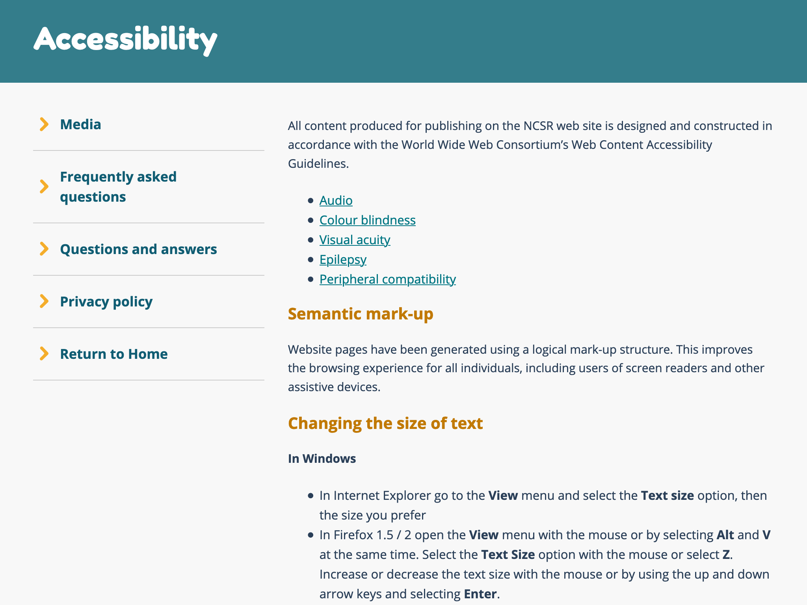

- How-to instructions that are not [Recipes](HI-re)
- Objective instructions on how to perform a task, often step-by-step
- E.g., rules of a game, tutorials, instructions on how to fill a form
- Subjective instructions should be annotated as [Advice](OP-av)
- Can be written on a personal, commercial or institutional website
- See Biber & Egbert 2018: 134-141

<!-- details -->

## Examples

<!-- START GENERATED SCREENSHOT GALLERY -->
<!--     NOTE: this screenshot gallery is automatically generated.       -->
<!--     Please avoid modifying it manually: any changes will be         -->
<!--     overwritten the next time the generation script is run.         -->
<table class="website-examples">
  <thead>
    <tr>
      <th class="website-examples-col-1">Information</th>
      <th class="website-examples-col-2">Screenshot (hover or click to enlarge)</th>
    </tr>
  </thead>
  <tbody>
    <tr>
      <td>
        
<b>URL</b>: <a href="https://ncsr.gov.au/content/ncsr/en/accessibility.html">https://ncsr.gov.au/content/ncsr/en/accessibility.html</a>

        
<b>Language</b>: English

        
<b>Description</b>: Accessibility page with step-by-step instructions for changing the font size in the browser

      </td>
      <td></td>
    </tr>
  </tbody>
</table>
<!-- END GENERATED SCREENSHOT GALLERY -->

### Ambiguous cases resolved to HI-oh
- An article by a page (similar to the pages on Facebook that can be followed) explaining the newest covid-19 measures and what people should do when returning from outside the border. The explanations on the things to do are very detailed with screen captures. It is not professionally written by journalists, nor in the format of typical news.
