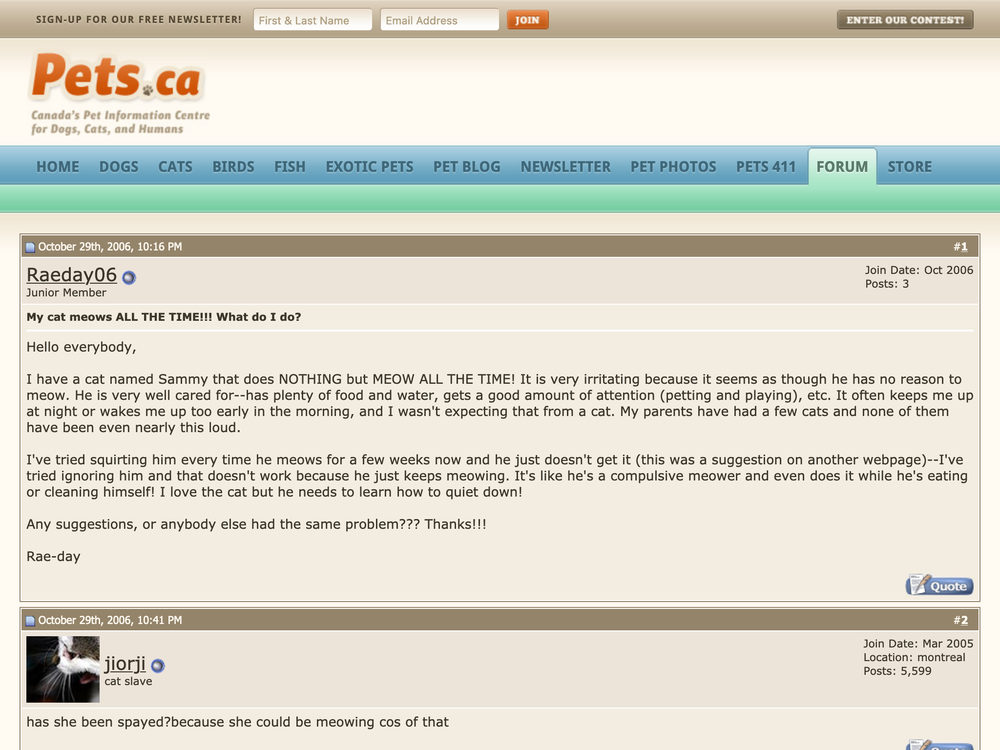

- Interactive forum discussions with discussion participants and possibly other readers
- Question-answer forums, where one person asks a question and one or several answer it
- Reader/viewer responses
- Originally written!
- See Biber & Ebgert 2018: 177-179, 

<!-- details -->

## Examples

<!-- START GENERATED SCREENSHOT GALLERY -->
<!--     NOTE: this screenshot gallery is automatically generated.       -->
<!--     Please avoid modifying it manually: any changes will be         -->
<!--     overwritten the next time the generation script is run.         -->
<table class="website-examples">
  <thead>
    <tr>
      <th class="website-examples-col-1">Information</th>
      <th class="website-examples-col-2">Screenshot (hover or click to enlarge)</th>
    </tr>
  </thead>
  <tbody>
    <tr>
      <td>
        
<b>URL</b>: <a href="http://pets.ca/forum/showthread.php?t=32222">http://pets.ca/forum/showthread.php?t=32222</a>

        
<b>Language</b>: English

        
<b>Description</b>: Pet information centre discussion board thread

      </td>
      <td></td>
    </tr>
  </tbody>
</table>
<!-- END GENERATED SCREENSHOT GALLERY -->
