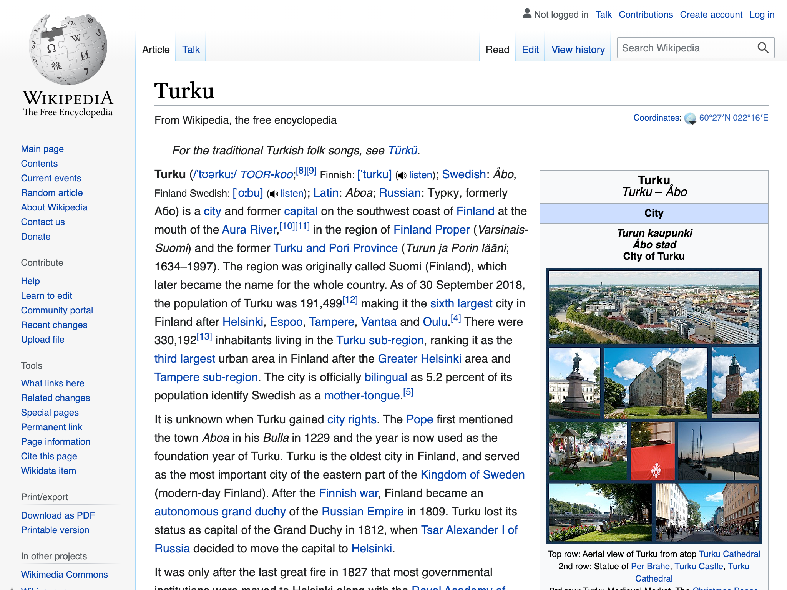
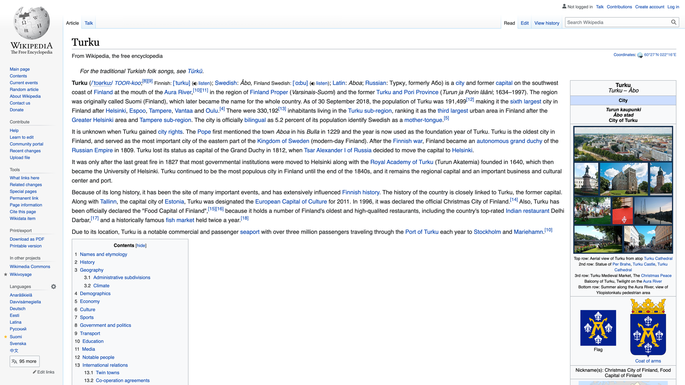

**Example**: <https://www.dictionary.com/browse/likelier>

**Example**: <https://en.wikipedia.org/wiki/Turku>

<!-- details -->

## Examples

<table class="website-examples">
  <thead>
    <tr>
      <th class="website-examples-col-1">Information</th>
      <th class="website-examples-col-2">Screenshot (hover or click to enlarge)</th>
    </tr>
  </thead>
  <tbody>
    <tr>
      <td>URL: <a href="https://en.wikipedia.org/wiki/Turku">https://en.wikipedia.org/wiki/Turku</a></td>
      <td></td>
    </tr>
    <tr>
      <td>URL: <a href="https://en.wikipedia.org/wiki/Turku">https://en.wikipedia.org/wiki/Turku</a></td>
      <td></td>
    </tr>
  </tbody>
</table>
