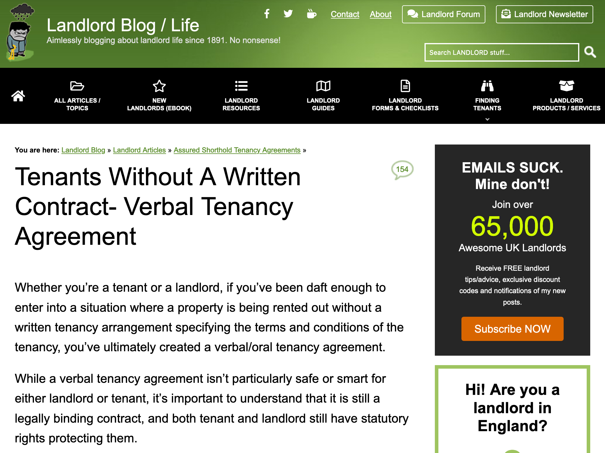
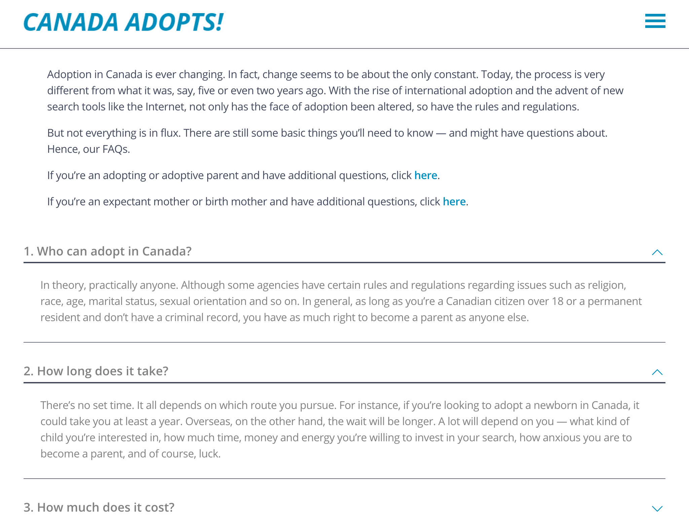

- Structured as questions-and-answers, to provide specific information about something or instructions on how to do something
- Websites with procedural information often have special pages with FAQs, anticipating questions that end-users may have
- The author is usually associated with an institutional or commercial site
- See Biber & Egbert 2018: 137, 145-146

<!-- details -->

## Examples

<!-- START GENERATED SCREENSHOT GALLERY -->
<!--     NOTE: this screenshot gallery is automatically generated.       -->
<!--     Please avoid modifying it manually: any changes will be         -->
<!--     overwritten the next time the generation script is run.         -->
<table class="website-examples">
  <thead>
    <tr>
      <th class="website-examples-col-1">Information</th>
      <th class="website-examples-col-2">Screenshot (hover or click to enlarge)</th>
    </tr>
  </thead>
  <tbody>
    <tr>
      <td>
        
<b>URL</b>: <a href="https://www.propertyinvestmentproject.co.uk/blog/tenants-without-a-written-contract/">https://www.propertyinvestmentproject.co.uk/blog/tenants-without-a-written-contract/</a>

        
<b>Language</b>: English

        
<b>Description</b>: Information about tenancy without a written contract presented in Q&amp;A format

      </td>
      <td></td>
    </tr>
    <tr>
      <td>
        
<b>URL</b>: <a href="https://www.canadaadopts.com/adopting-in-canada/adopting-canada-faqs/">https://www.canadaadopts.com/adopting-in-canada/adopting-canada-faqs/</a>

        
<b>Language</b>: English

        
<b>Description</b>: Frequently asked questions about adoption in Canada

      </td>
      <td></td>
    </tr>
  </tbody>
</table>
<!-- END GENERATED SCREENSHOT GALLERY -->
