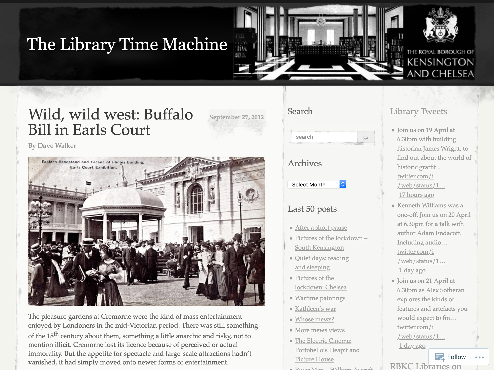

**Example**: <https://rbkclocalstudies.wordpress.com/2012/09/27/wild-wild-west-buffalo-bill-in-earls-court/>

<!-- details -->

<!-- START GENERATED SCREENSHOT GALLERY -->
<!--     NOTE: this screenshot gallery is automatically generated.       -->
<!--     Please avoid modifying it manually: any changes will be         -->
<!--     overwritten the next time the generation script is run.         -->
<table class="website-examples">
  <thead>
    <tr>
      <th class="website-examples-col-1">Information</th>
      <th class="website-examples-col-2">Screenshot (hover or click to enlarge)</th>
    </tr>
  </thead>
  <tbody>
    <tr>
      <td>
        
<b>URL</b>: <a href="https://rbkclocalstudies.wordpress.com/2012/09/27/wild-wild-west-buffalo-bill-in-earls-court/">https://rbkclocalstudies.wordpress.com/2012/09/27/wild-wild-west-buffalo-bill-in-earls-court/</a>

        
<b>Language</b>: English

        
<b>Description</b>: Historical narrative about Wild West shows

      </td>
      <td></td>
    </tr>
  </tbody>
</table>
<!-- END GENERATED SCREENSHOT GALLERY -->
