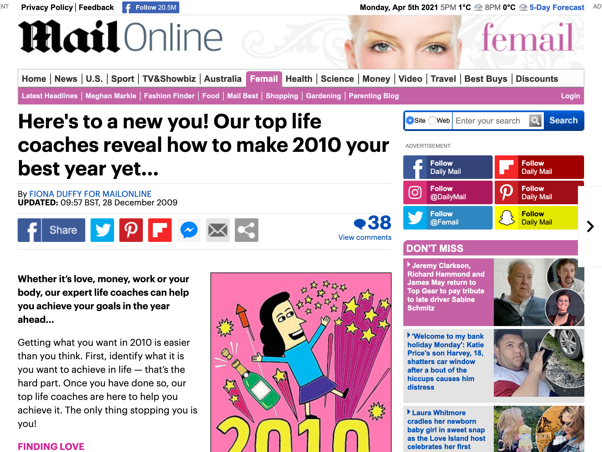
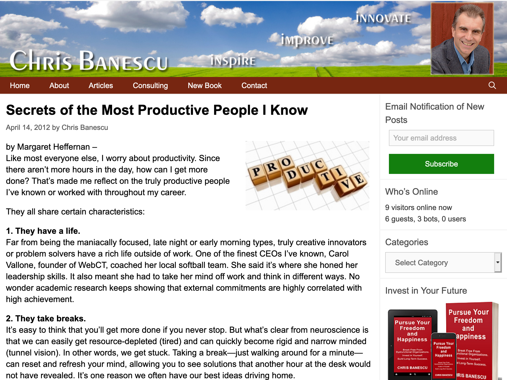

- Based on a personal opinion
- Purpose to offer advice that leads to suggested actions and solves a particular problem
- Objective instructions should be annotated as [Other how-to](HI-oh)
- Often associated with an institutional or commercial site
- Differs from [Opinion blogs](OP-ob) and other [Opinions](OP-oo) in being directive and suggesting actions for the reader
- Typical topics include healthcare, finding a job, parenting, training for a sport
- See Biber & Egbert 2018: 106-107, 113

<!-- details -->

## Examples

<!-- START GENERATED SCREENSHOT GALLERY -->
<!--     NOTE: this screenshot gallery is automatically generated.       -->
<!--     Please avoid modifying it manually: any changes will be         -->
<!--     overwritten the next time the generation script is run.         -->
<table class="website-examples">
  <thead>
    <tr>
      <th class="website-examples-col-1">Information</th>
      <th class="website-examples-col-2">Screenshot (hover or click to enlarge)</th>
    </tr>
  </thead>
  <tbody>
    <tr>
      <td>
        
<b>URL</b>: <a href="https://www.dailymail.co.uk/femail/article-1238812/The-thing-stopping-getting-want--heres-new-2010.html">https://www.dailymail.co.uk/femail/article-1238812/The-thing-stopping-getting-want--heres-new-2010.html</a>

        
<b>Language</b>: English

        
<b>Description</b>: Self-help article with advice from life coaches

      </td>
      <td></td>
    </tr>
    <tr>
      <td>
        
<b>URL</b>: <a href="https://www.chrisbanescu.com/2012/04/secrets-of-the-most-productive-people-i-know/">https://www.chrisbanescu.com/2012/04/secrets-of-the-most-productive-people-i-know/</a>

        
<b>Language</b>: English

        
<b>Description</b>: Productivity advice

      </td>
      <td></td>
    </tr>
  </tbody>
</table>
<!-- END GENERATED SCREENSHOT GALLERY -->

### Ambiguous cases resolved to OP-av
- Daily horoscopes
- Tips on how to win in a lottery or the pools
- A questionnaire and online test, which at the end will tell you if it is better for you to stay single or get married
